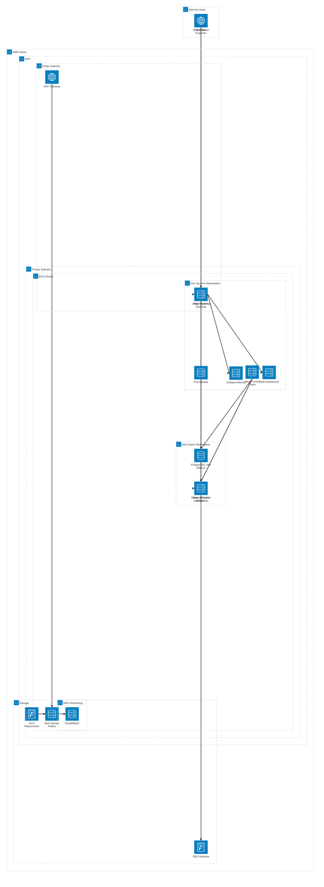
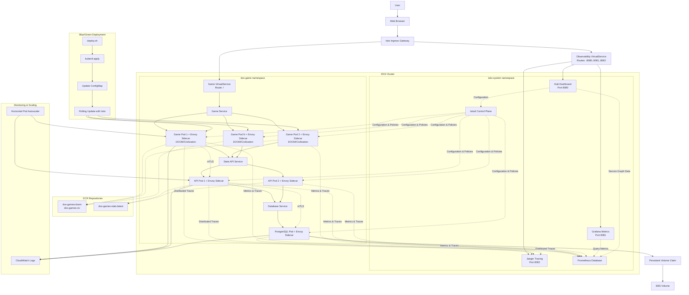

# AWS Kubernetes Capstone Project - DOS Games Platform with Istio Service Mesh

This project demonstrates a complete Kubernetes deployment on AWS EKS featuring Istio Service Mesh, DOS games (DOOM and Civilization) with blue/green deployment capabilities, and comprehensive observability. The project includes automation scripts for environment setup, containerisation, EKS deployment with Istio, and advanced traffic management with built-in monitoring dashboards.

## Project Structure

```
aws-capstone-2/
├── README.md               # This comprehensive guide
├── bootstrap.sh            # Install prerequisites, build and push Docker images (includes Istio CLI)
├── deploy.sh               # Deploy the application to EKS with Istio Service Mesh
├── destroy.sh              # Clean up all resources
├── docker/
│   ├── doom/
│   │   ├── Dockerfile      # DOOM game container
│   │   └── index.html      # DOOM frontend
│   ├── civ/
│   │   ├── Dockerfile      # Civilization game container
│   │   └── index.html      # Civilization frontend
│   └── stats-api/
│       ├── Dockerfile      # Stats API container
│       ├── app.js          # Node.js API server
│       └── package.json    # API dependencies
├── istio/
│   ├── gateway.yaml        # Istio Gateway and VirtualService for traffic routing
│   ├── destination-rules.yaml # Traffic policies and load balancing rules (v1.26.0 compatible)
│   ├── security-policies.yaml # mTLS and authorisation policies
│   ├── telemetry.yaml      # Observability configuration
│   ├── jaeger-tracing-config.yaml # ConfigMap configuration for default tracing
│   ├── observability-gateway.yaml # External access to dashboards
│   ├── ingress-gateway-service.yaml # Pre-configured observability ports
│   └── canary-virtual-service.yaml # Canary deployment configuration
├── k8s/
│   ├── namespace.yaml      # Kubernetes namespace (with Istio injection enabled)
│   ├── game-deployment.yaml# Game deployment
│   ├── game-service.yaml   # ClusterIP service (replaces LoadBalancer)
│   ├── database.yaml       # PostgreSQL for game stats
│   ├── stats-api.yaml      # Stats API deployment
│   ├── configmap.yaml      # Game configuration
│   ├── game-hpa.yaml       # Game auto-scaling
│   ├── stats-api-hpa.yaml  # API auto-scaling
│   ├── network-policy.yaml # Network security
│   ├── postgres-secret.yaml# Postgres database secrets
│   ├── postgres-pvc.yaml   # Database storage
│   └── storage-class.yaml  # Storage configuration
└── eks/
    └── cluster.yaml        # EKS cluster configuration
```

## Istio Service Mesh Integration

This project uses **Istio Service Mesh** to replace traditional AWS Load Balancers with advanced traffic management, security, and observability features. Istio provides:

### 🔧 **Service Mesh Features**
- **Traffic Management**: Advanced routing, load balancing, and circuit breaking
- **Security**: Mutual TLS, authentication, and authorisation policies
- **Observability**: Distributed tracing, metrics, and service topology visualisation
- **Sidecar Injection**: Automatic proxy injection for all pods

### 📊 **Built-in Observability Dashboards**
- **Kiali**: Service mesh visualisation and configuration validation
- **Grafana**: Metrics dashboards and performance monitoring  
- **Jaeger**: Distributed tracing and request flow analysis
- **Prometheus**: Metrics collection and alerting

### 🚀 **Traffic Management**
- **Intelligent Routing**: Route traffic based on headers, weights, or conditions
- **Circuit Breaking**: Automatic failure detection and traffic rerouting
- **Canary Deployments**: Gradual traffic shifting for safe deployments
- **Load Balancing**: Multiple algorithms (round robin, least request, etc.)

### 🔒 **Security Features**
- **Mutual TLS**: Automatic encryption between all services
- **Network Policies**: Fine-grained access control between pods
- **Authentication**: Service-to-service identity verification
- **Authorisation**: Role-based access control for microservices

### 📈 **Observability Dashboards (External Access)**
All observability tools are automatically deployed and accessible externally via the Istio Gateway:

- **Kiali**: Service mesh visualisation - `http://[GATEWAY-URL]:8080`
- **Grafana**: Metrics and monitoring - `http://[GATEWAY-URL]:8081` 
- **Jaeger**: Distributed tracing - `http://[GATEWAY-URL]:8082`

These dashboards are available immediately after deployment without requiring additional commands.

## Setting Up a Deployment EC2 Instance

This project is designed to be deployed from an Amazon Linux 2 EC2 instance rather than locally. Follow these steps to set up the deployment environment:

### Launch an Amazon Linux 2 Instance

1. Sign in to the AWS Management Console
2. Navigate to EC2 Dashboard
3. Click "Launch Instance"
4. Give the instance the name 'Kubernetes-Deployment-VM'
5. Choose "Amazon Linux 2023 AMI"
6. Select instance type (t2.micro recommended for this project)
7. Configure instance details:
   - Network: Default VPC
   - Auto-assign Public IP: Enable
8. Add storage (20 GB recommended for Docker images and builds)
9. Add tags as required
10. Configure Security Group:
    - Allow SSH (port 22) from 0.0.0.0/0
    - Allow HTTP (port 8000) for testing local Docker container if required
11. Proceed without key pair then launch instance
12. Wait for the instance to initialise

### Connect to the Instance

1. Navigate to the EC2 service and select Instances
2. Find the 'Kubernetes-Deployment-VM' instance
3. Select 'Connect'
4. Use EC2 Instance Connect and select 'Connect'

### Clone the Repository

```bash
# Install Git if not already installed
sudo yum update -y
sudo yum install -y git

# Clone the repository (replace with the actual repository URL)
git clone https://github.com/ascoarchitect/aws-capstone-2.git
cd aws-capstone-2

# Make scripts executable
chmod +x bootstrap.sh deploy.sh destroy.sh
```

## Prerequisites and IAM Permissions

**Pre-requisite**: You will need to have AWS CLI credentials already created to run this project. The IAM user will need extensive permissions for EKS, ECR, EC2, and related services.

### Required IAM Permissions

The IAM user or role needs the following permissions to deploy this project:

```json
{
    "Version": "2012-10-17",
    "Statement": [
        {
            "Effect": "Allow",
            "Action": [
                "eks:*",
                "ec2:*",
                "ecr:*",
                "iam:*",
                "cloudformation:*",
                "autoscaling:*",
                "elasticloadbalancing:*",
                "logs:*",
                "cloudwatch:*",
                "sts:GetCallerIdentity",
                "sts:AssumeRole",
                "ssm:GetParameter",
                "ssm:GetParameters"
            ],
            "Resource": "*"
        }
    ]
}
```

### Configure AWS Credentials

After setting up the IAM user with the required permissions:

```bash
# Configure AWS CLI with the credentials
aws configure
```

When prompted, enter:
- AWS Access Key ID: `[Your Access Key]`
- AWS Secret Access Key: `[Your Secret Key]`
- Default region name: `eu-west-1`
- Default output format: `json`

## Environment Setup

Run the bootstrap script to install all dependencies and build Docker images:

```bash
# Install required tools and build Docker images
./bootstrap.sh
```

The bootstrap script will:
- Install Docker, AWS CLI, kubectl, eksctl, and Istio CLI (v1.26.0)
- Verify AWS credentials and permissions
- Create ECR repositories for the Docker images
- Build Docker images for both games and the stats API
- Push all images to the ECR repositories
- Verify the setup is complete

**Note**: The Istio CLI (`istioctl`) is automatically installed during bootstrap. The project uses Istio v1.26.0 for advanced traffic management, security, and observability.

**Note**: The bootstrap process may take 10-15 minutes as it downloads dependencies and builds multiple Docker images.

## Deployment Guide

### 1. Build and Setup (First Time Only)

```bash
# Run this only once to set up everything
./bootstrap.sh
```

### 2. Deploy EKS Cluster and Application

Choose the initial game to deploy:

```bash
# Deploy with DOOM
./deploy.sh doom

# OR deploy with Civilization
./deploy.sh civ
```

This will:
- Create an EKS cluster with spot instances (cost-optimised)
- Install and configure Istio Service Mesh v1.26.0
- Deploy the selected game container with sidecar injection
- Deploy PostgreSQL database for stats
- Deploy Node.js stats API
- Configure auto-scaling (HPA)
- Set up Istio security policies and traffic management
- Automatically deploy observability tools (Kiali, Grafana, Jaeger, Prometheus)
- Create Istio Gateway for external access with pre-configured observability ports
- Configure external access to all dashboards via the same load balancer

### 3. Access the Application

After deployment completes:

```bash
# Get the Istio Gateway URL
kubectl get svc istio-ingressgateway -n istio-system

# The output will show an EXTERNAL-IP (AWS Load Balancer URL)
# Open this URL in your browser to access the game
```

**Istio Service Mesh Benefits**: The application now runs with automatic sidecar injection, providing enhanced security (mTLS), observability (distributed tracing), and traffic management capabilities.

### 4. Blue/Green Deployment (Game Switching)

Switch between games with zero downtime:

```bash
# Automatic switch (toggles between current game and the other)
./deploy.sh switch

# OR specify the game explicitly
./deploy.sh civ    # Switch to Civilization
./deploy.sh doom   # Switch to DOOM
```

**Important**: Game switching only updates the game container while keeping the database and stats API running, ensuring zero downtime and persistent game statistics across switches.

### 5. Access Observability Dashboards

Istio provides powerful observability tools that are automatically installed and accessible externally via the Istio Gateway:

**Dashboard URLs** (available after deployment):
- **Kiali**: `http://[GATEWAY-URL]:8080` - Service mesh visualisation and configuration validation
- **Grafana**: `http://[GATEWAY-URL]:8081` - Metrics dashboards and performance monitoring  
- **Jaeger**: `http://[GATEWAY-URL]:8082` - Distributed tracing and request flow analysis

These dashboards provide:
- **Real-time traffic flow visualisation**
- **Service dependency mapping**
- **Performance metrics and SLA monitoring**
- **Distributed request tracing**
- **Security policy validation**
- **Circuit breaker and retry statistics**

All observability tools (Kiali, Grafana, Jaeger, and Prometheus) are automatically installed during the initial deployment and accessible externally via the same load balancer as the game application.

**Alternative Access via Port-Forward** (if needed):
```bash
# Manual port-forward access (alternative method)
kubectl port-forward -n istio-system svc/kiali 20001:20001    # Access at localhost:20001
kubectl port-forward -n istio-system svc/grafana 3000:3000    # Access at localhost:3000  
kubectl port-forward -n istio-system svc/jaeger 16686:16686   # Access at localhost:16686
```

### 6. Monitor the Deployment

Check the status of the deployment:

```bash
# Check cluster status
kubectl get nodes

# Check all pods in the dos-game namespace
kubectl get pods -n dos-game

# Check Istio sidecar injection status
kubectl get pods -n dos-game -o jsonpath='{range .items[*]}{.metadata.name}{"\t"}{.spec.containers[*].name}{"\n"}{end}'

# Check Istio Gateway and services
kubectl get gateway,virtualservice,destinationrule -n dos-game

# Check Istio components
kubectl get pods -n istio-system

# Check horizontal pod autoscaling
kubectl get hpa -n dos-game

# Check sidecar proxy status
istioctl proxy-status

# View application logs
kubectl logs -f deployment/game-deployment -n dos-game
kubectl logs -f deployment/stats-api -n dos-game

# View Istio proxy logs (for debugging)
kubectl logs -f deployment/game-deployment -c istio-proxy -n dos-game
```

### 7. Clean Up Resources

When you've completed the project, clean up all AWS resources to avoid charges:

```bash
# This destroys all created resources including Istio
./destroy.sh
```

This will:
- Delete the EKS cluster and all associated resources
- Uninstall Istio Service Mesh and all components
- Remove ECR repositories and Docker images
- Clean up VPC, security groups, and load balancers
- Delete any persistent volumes and snapshots
- Remove Istio observability tools (Kiali, Grafana, Jaeger)

## Multiple Game Deployments

This project supports deployment of two different DOS games:

🎮 **DOOM**: Classic first-person shooter game  
🏛️ **Civilization**: Classic turn-based strategy game

You can specify which game to deploy by adding either `doom` or `civ` to the deployment commands.

**Note**: If you start the project build steps with one game type, you can switch between them using the blue/green deployment feature. The database and stats API persist across game switches, maintaining game statistics and user data.

## Project Components

### Infrastructure Components

- **EKS Cluster**: Kubernetes 1.32 cluster with managed node groups
- **Istio Service Mesh**: Advanced traffic management, security, and observability platform
- **EC2 Instances**: t3.medium spot instances for cost optimisation
- **VPC**: Dedicated VPC with public and private subnets
- **Istio Ingress Gateway**: Replaces traditional load balancer with advanced routing
- **Auto Scaling**: Horizontal Pod Autoscaler for dynamic scaling
- **ECR**: Container registry for Docker images
- **CloudWatch**: Monitoring and logging
- **Observability Stack**: Kiali, Grafana, Jaeger, and Prometheus included

### Application Components

- **Game Containers**: DOS games running in js-dos emulator with nginx (with Istio sidecars)
- **Stats API**: Node.js REST API for game statistics (with Istio sidecars)
- **Database**: PostgreSQL for persistent game data (with Istio sidecars)
- **Istio Sidecars**: Automatic proxy injection for all application pods
- **Configuration**: ConfigMaps for game and API settings
- **Storage**: Persistent volumes for database data
- **Istio Security**: Mutual TLS and authorisation policies for pod communication
- **Traffic Management**: VirtualServices and DestinationRules for intelligent routing

## Troubleshooting

### Common Issues and Solutions

**Permission Issues**:
- Ensure the IAM user has all the required permissions listed above
- Verify AWS credentials are correctly configured: `aws sts get-caller-identity`

**Bootstrap Failures**:
- Check internet connectivity for downloading dependencies
- Ensure sufficient disk space (20GB recommended)
- Verify Docker service is running: `sudo systemctl status docker`

**EKS Cluster Creation Issues**:
- Check AWS service limits for EC2 instances in the region
- Verify spot instance availability in eu-west-1
- Ensure eksctl version is compatible: `eksctl version`

**Application Not Accessible**:
- Check Istio Gateway status: `kubectl get gateway -n dos-game`
- Verify Istio Ingress Gateway: `kubectl get svc istio-ingressgateway -n istio-system`
- Check VirtualService configuration: `kubectl get virtualservice -n dos-game`
- Verify security group rules allow HTTP traffic
- Check pod status: `kubectl get pods -n dos-game`
- Analyse Istio configuration: `istioctl analyze`

**Game Switching Issues**:
- Ensure the target game image exists in ECR
- Check deployment rollout status: `kubectl rollout status deployment/game-deployment -n dos-game`
- Verify ConfigMap updates: `kubectl get configmap -n dos-game`
- Check Istio traffic routing: `kubectl get virtualservice -n dos-game -o yaml`
- Verify sidecar injection: `kubectl get pods -n dos-game -o jsonpath='{range .items[*]}{.metadata.name}{"\t"}{.spec.containers[*].name}{"\n"}{end}'`

**Istio-Specific Issues**:
- Check if istioctl is installed: `istioctl version --client`
- Verify Istio control plane: `kubectl get pods -n istio-system`
- Check sidecar injection: `kubectl get namespace dos-game -o yaml | grep istio-injection`
- Analyse configuration issues: `istioctl analyze -n dos-game`
- Check proxy status: `istioctl proxy-status`
- View proxy configuration: `istioctl proxy-config cluster <pod-name>.dos-game`

**Resource Cleanup Issues**:
- If destroy script fails, manually delete the EKS cluster from AWS Console
- Check for remaining ECR repositories and delete manually if needed
- Verify all CloudFormation stacks are deleted

### Debugging Commands

```bash
# Check cluster events
kubectl get events -n dos-game --sort-by=.metadata.creationTimestamp

# Describe problematic pods
kubectl describe pod <pod-name> -n dos-game

# Check application logs
kubectl logs <pod-name> -n dos-game

# Check Istio sidecar logs
kubectl logs <pod-name> -c istio-proxy -n dos-game

# Analyse Istio configuration
istioctl analyze

# Check Istio proxy status
istioctl proxy-status

# Get proxy configuration for debugging
istioctl proxy-config cluster <pod-name>.dos-game
istioctl proxy-config listener <pod-name>.dos-game
istioctl proxy-config route <pod-name>.dos-game

# Check Istio components
kubectl get pods -n istio-system
kubectl logs -n istio-system -l app=istiod

# Verify traffic flow
istioctl proxy-config endpoint <pod-name>.dos-game
```

## Features

- Advanced traffic management, security, and observability
- All pods automatically get Istio proxy sidecars
- Kiali, Grafana, and Jaeger dashboards included
- Automatic encryption between all services
- Advanced load balancing and circuit breaking
- Automated environment setup with Docker image pre-building
- Containerised DOS games (DOOM and Civilization) with stats API
- Container registry integration (ECR) with multi-image support
- EKS cluster with spot instances
- Backend PostgreSQL database for game statistics
- Auto-scaling capabilities (HPA)
- Blue/green deployment for zero-downtime game switching
- Cost-optimised for development

## Workflow

1. **Bootstrap Phase**: Install all tools (Docker, AWS CLI, kubectl, eksctl, Istio CLI v1.26.0), build and push Docker images to ECR
2. **Deploy Phase**: Create EKS cluster, install Istio Service Mesh with observability tools, and deploy applications
3. **Observability Phase**: Access automatically installed Kiali, Grafana, and Jaeger dashboards for monitoring
4. **Switch Phase**: Blue/green deployment between games with Istio traffic management
5. **Monitor Phase**: Use Istio observability tools to track performance and security
6. **Destroy Phase**: Clean up all AWS resources including Istio components

## Architecture

### Infrastructure Architecture

The following diagram shows the complete AWS infrastructure architecture for this Kubernetes deployment:



### Application Data Flow

This diagram illustrates how data flows through the application during normal operation and blue/green deployments:



### Architecture Components

#### **Service Mesh Layer (Istio)**
- **Istiod Control Plane**: Manages configuration, security, and traffic policies
- **Envoy Sidecars**: Automatic proxy injection for all application pods
- **Ingress Gateway**: Intelligent traffic routing and load balancing
- **Observability Stack**: Kiali, Grafana, Jaeger, and Prometheus for monitoring

#### **Application Layer**
- **Frontend**: DOS games running in js-dos emulator with Istio sidecars
- **Backend**: Node.js stats API + PostgreSQL database with Istio sidecars
- **Service Communication**: All inter-service communication secured with mTLS

#### **Infrastructure Layer**
- **EKS Cluster**: Kubernetes 1.32 with managed node groups and auto-scaling
- **Networking**: Istio-managed traffic with advanced routing and circuit breaking
- **Storage**: Persistent volumes for database data with EBS encryption
- **Security**: Istio authorisation policies and automatic mutual TLS

#### **Deployment Strategy**
- **Blue/Green**: Zero-downtime game switching with Istio traffic management
- **Auto-scaling**: Horizontal Pod Autoscaler for dynamic scaling
- **Observability**: Real-time monitoring and distributed tracing

### Container Architecture with Istio Service Mesh

1. **Game Container** (Variable): 
   - Image: `dos-games:doom` or `dos-games:civ`
   - **Istio Sidecar**: Envoy proxy automatically injected
   - Switches during blue/green deployments with Istio traffic management
   - Contains the DOS game, js-dos emulator, and nginx proxy
   - Separate containers and images for each game
   - **mTLS Communication**: Automatic encryption with other services

2. **Stats API Container** (Persistent):
   - Image: `dos-games-stats:latest`
   - **Istio Sidecar**: Envoy proxy automatically injected
   - Remains running during game switches
   - Node.js API for game statistics
   - **Distributed Tracing**: Integrated with Jaeger for request tracking
   - **mTLS Communication**: Secure connection to PostgreSQL

3. **Database Container** (Persistent):
   - Image: `postgres:17-alpine`
   - **Istio Sidecar**: Envoy proxy automatically injected
   - Remains running during game switches
   - Stores persistent game data and statistics
   - **Service Mesh Security**: Protected by Istio authorisation policies
   - Uses persistent volumes for data retention

4. **Observability Stack** (Istio System):
   - **Kiali**: Service mesh visualisation and configuration management
   - **Grafana**: Metrics dashboards with Prometheus data source
   - **Jaeger**: Distributed tracing and request flow analysis
   - **Prometheus**: Metrics collection from all Envoy sidecars
   - **External Access**: All dashboards accessible via Istio Gateway on dedicated ports

## Security Considerations

- **Istio Mutual TLS**: Automatic encryption and authentication between all services
- **Istio Authorisation Policies**: Fine-grained access control based on service identity
- **Network Policies**: Kubernetes network policies restrict pod-to-pod communication
- **Private Networking**: EKS worker nodes deployed in private subnets
- **Security Groups**: Properly configured security groups for Istio Gateway and node groups
- **RBAC**: Kubernetes Role-Based Access Control for service accounts
- **Encrypted Storage**: EBS volumes are encrypted at rest
- **IAM Roles**: Least privilege IAM roles for EKS services
- **Traffic Encryption**: All inter-service communication encrypted by default
