# AWS Kubernetes Capstone Project - DOS Games Platform

This project demonstrates a complete Kubernetes deployment on AWS EKS, featuring DOS games (DOOM and Civilization) with blue/green deployment capabilities. The project includes comprehensive automation scripts for environment setup, containerisation, EKS deployment, and blue/green application updates.

## Project Structure

```
aws-capstone-2/
├── README.md            # This comprehensive guide
├── TESTING.md          # Testing procedures and validation
├── bootstrap.sh        # Install prerequisites, build and push Docker images
├── deploy.sh           # Deploy the application to EKS
├── destroy.sh          # Clean up all resources
├── docker/
│   ├── doom/
│   │   ├── Dockerfile  # DOOM game container
│   │   └── index.html  # DOOM frontend
│   ├── civ/
│   │   ├── Dockerfile  # Civilization game container
│   │   └── index.html  # Civilization frontend
│   └── stats-api/
│       ├── Dockerfile  # Stats API container
│       ├── app.js      # Node.js API server
│       └── package.json# API dependencies
├── k8s/
│   ├── namespace.yaml      # Kubernetes namespace
│   ├── game-deployment.yaml# Game deployment
│   ├── game-service.yaml   # Load balancer service
│   ├── database.yaml       # PostgreSQL for game stats
│   ├── stats-api.yaml      # Stats API deployment
│   ├── configmap.yaml      # Game configuration
│   ├── game-hpa.yaml       # Game auto-scaling
│   ├── stats-api-hpa.yaml  # API auto-scaling
│   ├── network-policy.yaml # Network security
│   ├── postgres-pvc.yaml   # Database storage
│   └── storage-class.yaml  # Storage configuration
└── eks/
    └── cluster.yaml        # EKS cluster configuration
```

## Setting Up a Deployment EC2 Instance

This project is designed to be deployed from an Amazon Linux 2 EC2 instance rather than locally. Follow these steps to set up your deployment environment:

### Launch an Amazon Linux 2 Instance

1. Sign in to the AWS Management Console
2. Navigate to EC2 Dashboard
3. Click "Launch Instance"
4. Give the instance the name 'Kubernetes-Deployment-VM'
5. Choose "Amazon Linux 2 AMI"
6. Select instance type (t2.micro recommended for this project)
7. Configure instance details:
   - Network: Default VPC
   - Auto-assign Public IP: Enable
8. Add storage (20 GB recommended for Docker images and builds)
9. Add tags as required
10. Configure Security Group:
    - Allow SSH (port 22) from your IP
    - Allow HTTP (port 8000) for testing local Docker container if required
11. Proceed without key pair then launch instance
12. Wait for the instance to initialise

### Connect to Your Instance

1. Navigate to the EC2 service and select Instances
2. Find your 'Kubernetes-Deployment-VM' instance
3. Select 'Connect'
4. Use EC2 Instance Connect and select 'Connect'

### Clone the Repository

```bash
# Install Git if not already installed
sudo yum update -y
sudo yum install -y git

# Clone the repository (replace with your actual repository URL)
git clone https://github.com/ascoarchitect/aws-capstone-2.git
cd aws-capstone-2

# Make scripts executable
chmod +x bootstrap.sh deploy.sh destroy.sh
```

## Prerequisites and IAM Permissions

**Pre-requisite**: You will need to have AWS CLI credentials already created to run this project. The IAM user will need extensive permissions for EKS, ECR, EC2, and related services.

### Required IAM Permissions

The IAM user or role needs the following permissions to deploy this project:

```json
{
    "Version": "2012-10-17",
    "Statement": [
        {
            "Effect": "Allow",
            "Action": [
                "eks:*",
                "ec2:*",
                "ecr:*",
                "iam:*",
                "cloudformation:*",
                "autoscaling:*",
                "elasticloadbalancing:*",
                "logs:*",
                "cloudwatch:*",
                "sts:GetCallerIdentity",
                "sts:AssumeRole",
                "ssm:GetParameter",
                "ssm:GetParameters"
            ],
            "Resource": "*"
        }
    ]
}
```

### Configure AWS Credentials

After setting up your IAM user with the required permissions:

```bash
# Configure AWS CLI with your credentials
aws configure
```

When prompted, enter:
- AWS Access Key ID: `[Your Access Key]`
- AWS Secret Access Key: `[Your Secret Key]`
- Default region name: `eu-west-1`
- Default output format: `json`

## Environment Setup

Run the bootstrap script to install all dependencies and build Docker images:

```bash
# Install required tools and build Docker images
./bootstrap.sh
```

The bootstrap script will:
- Install Docker, AWS CLI, kubectl, eksctl, and other dependencies
- Verify AWS credentials and permissions
- Create ECR repositories for your Docker images
- Build Docker images for both games and the stats API
- Push all images to your ECR repositories
- Verify the setup is complete

**Note**: The bootstrap process may take 10-15 minutes as it downloads dependencies and builds multiple Docker images.

## Deployment Guide

### 1. Build and Setup (First Time Only)

```bash
# Run this only once to set up everything
./bootstrap.sh
```

### 2. Deploy EKS Cluster and Application

Choose your initial game to deploy:

```bash
# Deploy with DOOM
./deploy.sh doom

# OR deploy with Civilization
./deploy.sh civ
```

This will:
- Create an EKS cluster with spot instances (cost-optimised)
- Deploy the selected game container
- Deploy PostgreSQL database for stats
- Deploy Node.js stats API
- Configure auto-scaling (HPA)
- Set up network policies and storage
- Create Application Load Balancer

### 3. Access Your Application

After deployment completes:

```bash
# Get the load balancer URL
kubectl get svc -n dos-game game-service

# The output will show an EXTERNAL-IP (AWS Load Balancer URL)
# Open this URL in your browser to access the game
```

### 4. Blue/Green Deployment (Game Switching)

Switch between games with zero downtime:

```bash
# Automatic switch (toggles between current game and the other)
./deploy.sh switch

# OR specify the game explicitly
./deploy.sh civ    # Switch to Civilization
./deploy.sh doom   # Switch to DOOM
```

**Important**: Game switching only updates the game container while keeping the database and stats API running, ensuring zero downtime and persistent game statistics across switches.

### 5. Monitor Your Deployment

Check the status of your deployment:

```bash
# Check cluster status
kubectl get nodes

# Check all pods in the dos-game namespace
kubectl get pods -n dos-game

# Check services and load balancer
kubectl get svc -n dos-game

# Check horizontal pod autoscaling
kubectl get hpa -n dos-game

# View application logs
kubectl logs -f deployment/game-deployment -n dos-game
kubectl logs -f deployment/stats-api -n dos-game
```

### 6. Clean Up Resources

When you've completed the project, clean up all AWS resources to avoid charges:

```bash
# This destroys all created resources
./destroy.sh
```

This will:
- Delete the EKS cluster and all associated resources
- Remove ECR repositories and Docker images
- Clean up VPC, security groups, and load balancers
- Delete any persistent volumes and snapshots

## Multiple Game Deployments

This project supports deployment of two different DOS games:

🎮 **DOOM**: Classic first-person shooter game  
🏛️ **Civilization**: Classic turn-based strategy game

You can specify which game to deploy by adding either `doom` or `civ` to the deployment commands.

**Note**: If you start your project build steps with one game type, you can switch between them using the blue/green deployment feature. The database and stats API persist across game switches, maintaining game statistics and user data.

## Project Components

### Infrastructure Components

- **EKS Cluster**: Kubernetes 1.32 cluster with managed node groups
- **EC2 Instances**: t3.medium spot instances for cost optimisation
- **VPC**: Dedicated VPC with public and private subnets
- **Application Load Balancer**: Distributes traffic across game pods
- **Auto Scaling**: Horizontal Pod Autoscaler for dynamic scaling
- **ECR**: Container registry for Docker images
- **CloudWatch**: Monitoring and logging

### Application Components

- **Game Containers**: DOS games running in js-dos emulator with nginx
- **Stats API**: Node.js REST API for game statistics
- **Database**: PostgreSQL for persistent game data
- **Configuration**: ConfigMaps for game and API settings
- **Storage**: Persistent volumes for database data
- **Network Policies**: Security policies for pod communication

## Troubleshooting

### Common Issues and Solutions

**Permission Issues**:
- Ensure your IAM user has all the required permissions listed above
- Verify AWS credentials are correctly configured: `aws sts get-caller-identity`

**Bootstrap Failures**:
- Check internet connectivity for downloading dependencies
- Ensure sufficient disk space (20GB recommended)
- Verify Docker service is running: `sudo systemctl status docker`

**EKS Cluster Creation Issues**:
- Check AWS service limits for EC2 instances in your region
- Verify spot instance availability in eu-west-1
- Ensure eksctl version is compatible: `eksctl version`

**Application Not Accessible**:
- Check load balancer status: `kubectl get svc -n dos-game`
- Verify security group rules allow HTTP traffic
- Check pod status: `kubectl get pods -n dos-game`

**Game Switching Issues**:
- Ensure the target game image exists in ECR
- Check deployment rollout status: `kubectl rollout status deployment/game-deployment -n dos-game`
- Verify ConfigMap updates: `kubectl get configmap -n dos-game`

**Resource Cleanup Issues**:
- If destroy script fails, manually delete the EKS cluster from AWS Console
- Check for remaining ECR repositories and delete manually if needed
- Verify all CloudFormation stacks are deleted

### Debugging Commands

```bash
# Check cluster events
kubectl get events -n dos-game --sort-by=.metadata.creationTimestamp

# Describe problematic pods
kubectl describe pod <pod-name> -n dos-game

# Check application logs
kubectl logs <pod-name> -n dos-game
```

## Features

- Automated environment setup with Docker image pre-building
- Containerised DOS games (DOOM and Civilization) with stats API
- Container registry integration (ECR) with multi-image support
- EKS cluster with spot instances
- Backend PostgreSQL database for game statistics
- Auto-scaling capabilities (HPA)
- Blue/green deployment for zero-downtime game switching
- Cost-optimised for development

## Workflow

1. **Bootstrap Phase**: Build and push all Docker images to ECR
2. **Deploy Phase**: Create EKS cluster and deploy applications
3. **Switch Phase**: Blue/green deployment between games
4. **Destroy Phase**: Clean up all AWS resources

## Architecture

### Infrastructure Architecture

The following diagram shows the complete AWS infrastructure architecture for this Kubernetes deployment:


### Application Data Flow

This diagram illustrates how data flows through the application during normal operation and blue/green deployments:

```mermaid
flowchart TD
    %% User interaction
    User[👤 User] --> Browser[🌐 Web Browser]
    Browser --> ALB[⚖️ Application Load Balancer]
    
    %% Load balancer routing
    ALB --> GameService[🎯 Kubernetes Service<br/>game-service]
    
    %% Blue/Green deployment pods
    subgraph EKS["🚢 EKS Cluster"]
        subgraph Namespace["📦 dos-game namespace"]
            GameService --> GamePod1[🎮 Game Pod 1<br/>DOOM/Civilization]
            GameService --> GamePod2[🎮 Game Pod 2<br/>DOOM/Civilization]
            GameService --> GamePodN[🎮 Game Pod N<br/>DOOM/Civilization]
            
            %% Persistent services
            GamePod1 --> StatsAPI[📊 Stats API Service]
            GamePod2 --> StatsAPI
            GamePodN --> StatsAPI
            
            StatsAPI --> APIPod1[🔧 API Pod 1]
            StatsAPI --> APIPod2[🔧 API Pod 2]
            
            APIPod1 --> DBService[🗄️ Database Service]
            APIPod2 --> DBService
            
            DBService --> PostgreSQL[🐘 PostgreSQL Pod]
        end
    end
    
    %% External storage
    PostgreSQL --> PVC[💾 Persistent Volume Claim]
    PVC --> EBS[💿 EBS Volume]
    
    %% Container registry
    subgraph ECR["📦 ECR Repositories"]
        GameImages[🎮 dos-games:doom<br/>🎮 dos-games:civ]
        APIImage[🔧 dos-games-stats:latest]
    end
    
    %% Blue/Green deployment flow
    subgraph BlueGreen["🔄 Blue/Green Deployment"]
        DeployScript[📜 deploy.sh] --> K8sUpdate[⚙️ kubectl apply]
        K8sUpdate --> ConfigUpdate[🔧 Update ConfigMap]
        ConfigUpdate --> RollingUpdate[🔄 Rolling Update]
        RollingUpdate --> GamePod1
        RollingUpdate --> GamePod2
        RollingUpdate --> GamePodN
    end
    
    %% Image pulls
    GamePod1 -.-> GameImages
    GamePod2 -.-> GameImages
    GamePodN -.-> GameImages
    APIPod1 -.-> APIImage
    APIPod2 -.-> APIImage
    
    %% Monitoring
    subgraph Monitoring["📈 Monitoring & Scaling"]
        HPA[📏 Horizontal Pod Autoscaler]
        CloudWatch[☁️ CloudWatch Logs]
        
        HPA --> GamePod1
        HPA --> APIPod1
        
        GamePod1 --> CloudWatch
        APIPod1 --> CloudWatch
        PostgreSQL --> CloudWatch
    end
```



### Architecture Components

- **Frontend**: DOS games running in js-dos emulator
- **Backend**: Node.js stats API + PostgreSQL database
- **Infrastructure**: AWS EKS with auto-scaling and spot instances
- **Deployment**: Blue/green strategy for zero-downtime game switching
- **Storage**: Persistent volumes for database data

### Container Architecture

1. **Game Container** (Variable): 
   - Image: `dos-games:doom` or `dos-games:civ`
   - Switches during blue/green deployments
   - Contains the DOS game, js-dos emulator, and nginx proxy
   - Separate containers and images for each game

2. **Stats API Container** (Persistent):
   - Image: `dos-games-stats:latest`
   - Remains running during game switches
   - Node.js API for game statistics
   - Connects to PostgreSQL database

3. **Database Container** (Persistent):
   - Image: `postgres:15-alpine`
   - Remains running during game switches
   - Stores persistent game data and statistics
   - Uses persistent volumes for data retention

## Security Considerations

- **Network Policies**: Kubernetes network policies restrict pod-to-pod communication
- **Private Networking**: EKS worker nodes deployed in private subnets
- **Security Groups**: Properly configured security groups for ALB and node groups
- **RBAC**: Kubernetes Role-Based Access Control for service accounts
- **Encrypted Storage**: EBS volumes are encrypted at rest
- **IAM Roles**: Least privilege IAM roles for EKS services

## Development and Testing

For development and testing procedures, see:
- `IMPLEMENTATION.md` - Technical implementation details
- `TESTING.md` - Testing procedures and validation steps

## Support and Documentation

- **Issues**: Report issues in the project repository
- **Documentation**: Additional documentation in project files
- **Logs**: Use kubectl commands to access application and cluster logs
- **Monitoring**: CloudWatch integration provides metrics and alerting

## License

This project is licensed under the Apache License 2.0 - see the `LICENSE` file for details.

## Important Notes

- **Region**: This project is configured for `eu-west-1` region by default
- **Costs**: Monitor AWS costs, especially if running for extended periods
- **Cleanup**: Always run `./destroy.sh` when finished to avoid unnecessary charges
- **Spot Instances**: May be interrupted; use only for development/learning
- **Resource Limits**: Default configuration uses minimal resources for cost optimisation

Remember to run `./destroy.sh` when you've completed the project to avoid incurring unnecessary AWS charges. The project is designed for learning and development purposes with cost optimisation as a primary consideration.